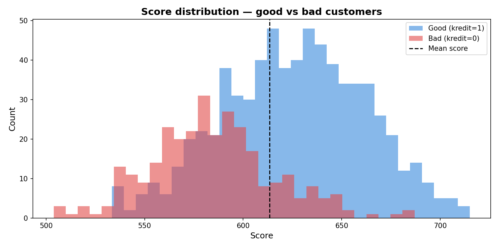
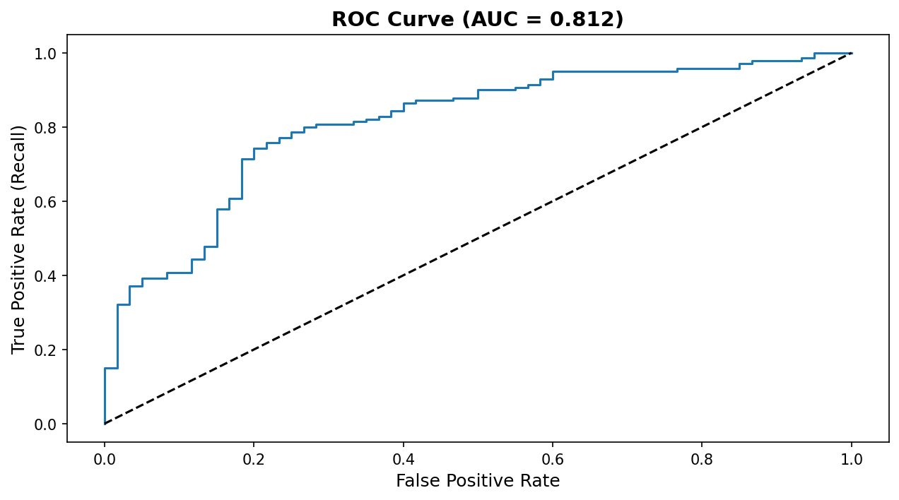

# Credit Risk Scorecard — WoE/IV Methodology

**Author:** Mathias Alejandro Gómez Chan  
**Date:** April 2026  
**LinkedIn:** [mathiasgomez-ds](https://www.linkedin.com/in/mathiasgomez-ds)  
**GitHub:** [Mathias70473](https://github.com/Mathias70473)

---

## Overview

This project builds a production-style credit scorecard using the German Credit 
Dataset, following the industry-standard methodology used by banks and fintechs. 
The scorecard assigns an integer score to each applicant based on financial and 
demographic variables, ranking them by risk of default.

Unlike simpler classification models, this project implements the full 
Weight of Evidence (WoE) and Information Value (IV) pipeline — the same 
methodology used by credit risk teams in production environments.

---

## Results

| Metric | Value |
|---|---|
| ROC-AUC | 0.8115 |
| Gini | 0.62 |
| KS Statistic | 0.51 |
| Score range | 504 – 715 |
| Mean score | 613 |





---

## Methodology

The pipeline follows five stages:

1. **Exploratory Data Analysis** — distribution analysis, missing value check, 
   target variable analysis, relationship between features and default rate
2. **WoE/IV Computation** — binning strategy, WoE per bin, IV per variable 
   for all 20 features
3. **Feature Selection** — variables with IV ≥ 0.10 selected (8 features retained)
4. **Logistic Regression** — fitted on WoE-encoded features, coefficients 
   validated with statsmodels, borderline variable pruned based on p-value 
   and business justification
5. **Scorecard Scaling** — PDO method converts log-odds to integer points 
   (base score 600, PDO 20, base odds 2)

---

## Selected Features

| Variable | Name | IV | Power |
|---|---|---|---|
| laufkont | Checking account status | 0.6660 | Very strong |
| moral | Credit history | 0.2932 | Medium |
| laufzeit | Duration | 0.2465 | Medium |
| sparkont | Savings account | 0.1960 | Medium |
| verw | Purpose | 0.1692 | Medium |
| hoehe | Amount | 0.1138 | Medium |
| alter | Age | 0.1048 | Medium |

---

## Dataset

- **Source:** UCI Machine Learning Repository — German Credit Data
- **Size:** 1,000 observations, 20 features
- **Target:** `kredit` — 1 = good credit, 0 = bad credit (default)
- **Class balance:** 70% good, 30% bad

> For full dataset documentation refer to the 
> [UCI Machine Learning Repository](https://archive.ics.uci.edu/dataset/144/statlog+german+credit+data)

---

## Project Structure

02-credit-risk-scorecard/
├── data/
│   └── raw/
│       ├── german_credit_data.csv
│       └── woe_encoded.csv
├── notebooks/
│   └── credit_risk_scorecard.ipynb
├── outputs/
│   └── figures/
│       ├── score_distribution.png
│       └── roc_curve.png
└── README.md
---

## How to Run

**Requirements:**
pandas
numpy
scikit-learn
statsmodels
scipy
matplotlib
seaborn

**Install dependencies:**
```bash
pip install pandas numpy scikit-learn statsmodels scipy matplotlib seaborn
```

**Run the notebook:**
```bash
git clone https://github.com/Mathias70473/data-science-portfolio.git
cd data-science-portfolio/02-credit-risk-scorecard
jupyter notebook notebooks/credit_risk_scorecard.ipynb
```

Run all cells top to bottom. The notebook is self-contained — all intermediate 
files are generated during execution.

---

## Limitations

- Sample size limited to 1,000 observations
- Dataset collected in 1990s Germany — may not reflect current credit behavior
- Recall of 0.47 on bad customers — borderline applicants recommended for manual review

---

## Related Projects

- [Project 1 — Payment Default Prediction](../01-payment-default-prediction)